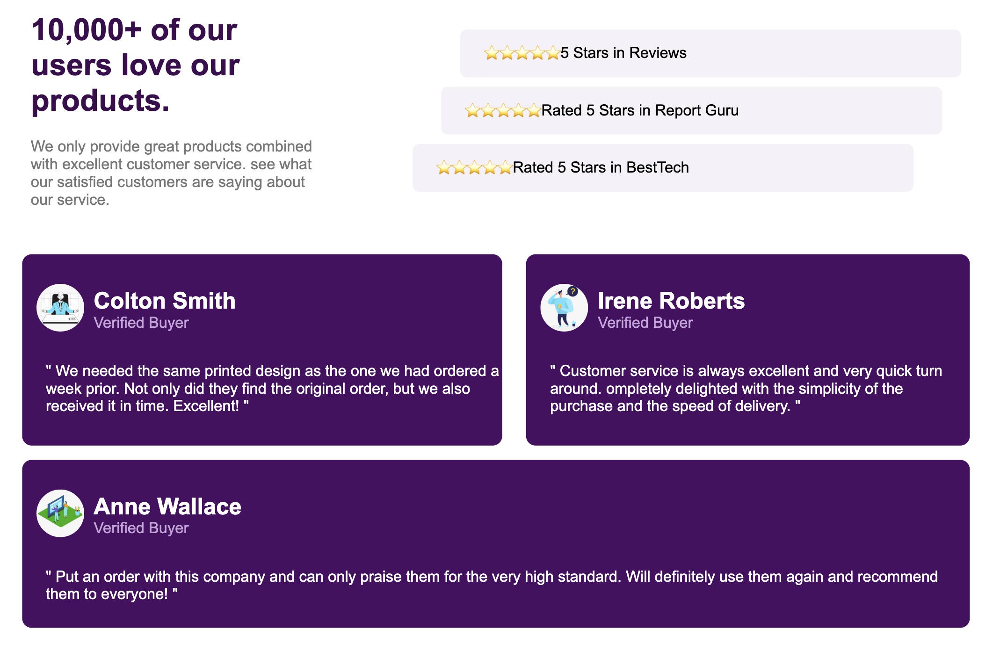
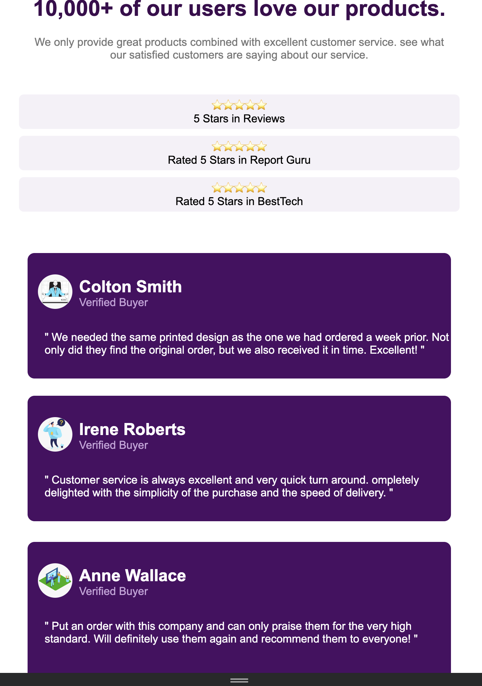

A. Description du Projet

Ce projet consiste en une page web présentant une section de preuves sociales (Social Proof Section) qui met en valeur les avis clients et les évaluations d'une entreprise. L'objectif est de renforcer la crédibilité et la confiance auprès des visiteurs.

B. Objectifs

Créer une interface attrayante présentant des témoignages clients
Afficher des évaluations avec un système d'étoiles
Structurer l'information de manière hiérarchique et lisible
Assurer la responsivité pour différents appareils
Utiliser une sémantique HTML appropriée

C. Balises Principales

<!DOCTYPE html> : Déclaration du type de document
<html lang="fr"> : Racine du document avec langue française
<head> : Métadonnées et liens vers les ressources externes
<body> : Contenu visible de la page

D. Sections du Contenu

1. En-tête (<head>)
<meta charset="UTF-8"> <!-- Encodage des caractères -->
<meta name="viewport" content="width=device-width, initial-scale=1.0"> <!-- Responsive -->
<title>Social Proof Section</title> <!-- Titre de l'onglet -->
<link rel="stylesheet" href="style.css" /> <!-- Lien vers le CSS -->

2. Section Principale (<section class="social-proof">)
Bloc A : Présentation générale et évaluations
A1 : Titre et description
A2 : Évaluations avec étoiles
Bloc B : Témoignages clients (Colton Smith et Irene Roberts)
Bloc C : Témoignage supplémentaire (Anne Wallace)

E. Classes CSS Utilisées

1. Structure Principale
.social-proof : Conteneur principal
.A, .B, .C : Divisions principales du contenu

2. Composants Spécifiques
.A1 : Zone titre et description
.A2, .A2_1, .A2_2, .A2_3 : Conteneurs d'évaluations
.B1, .B2, .C1 : Cartes de témoignages
.colton : Informations utilisateur (nom et statut)
.buyer : Badge "Verified Buyer"
.paragraphe : Paragraphes de témoignages

